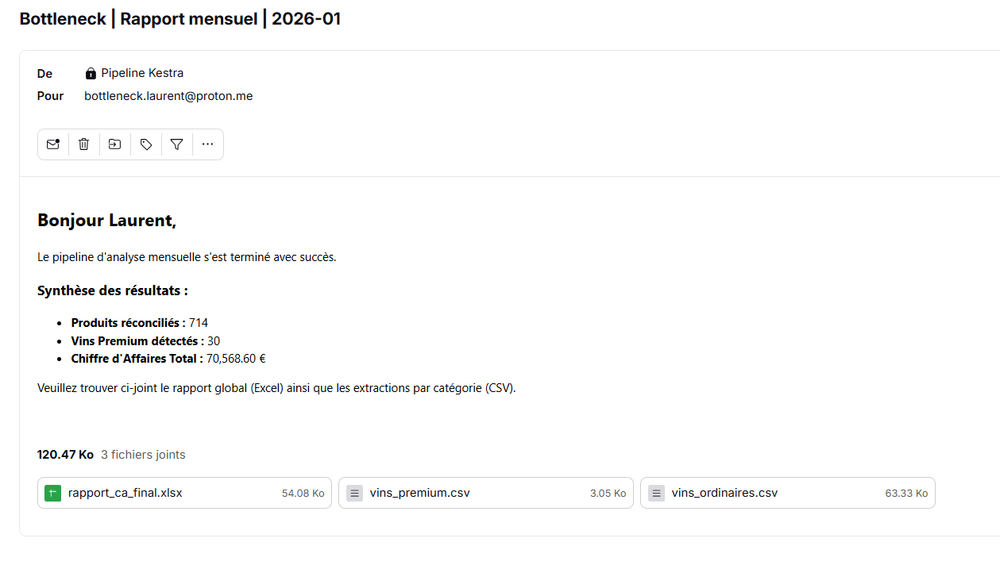
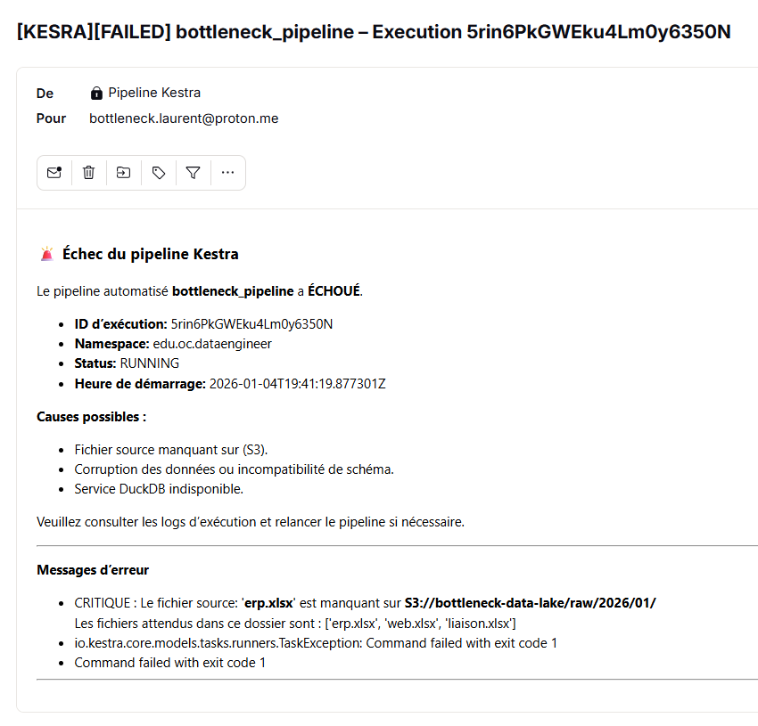

# 🍷 BottleNeck Data Pipeline - Automated Orchestration

## 🎯 Project Overview

This project industrializes the data analysis process for **BottleNeck**, a fictional wine merchant. The goal was to build a robust, fully automated ETL pipeline to reconcile ERP data with Web sales data, perform statistical analysis (Z-Score), and deliver monthly business reports to stakeholders.

## 🏗️ Architecture & Data Lineage

The pipeline is built on a **Decoupled Architecture** (Storage vs. Compute), ensuring scalability and durability.

### ⚙️ Pipeline Workflow

1. **Ingestion**: Dynamic time-partitioned download from **AWS S3** (`raw/YYYY/MM`).
2. **Vital Check**: Python-based integrity check (file existence & file size).
3. **Processing**: Cleaning, deduplication, and reconciliation using **DuckDB** (SQL) for high-performance analytics.
4. **Analysis**: Statistical wine classification (Premium vs. Ordinary) via a **Custom Dockerized Python Script**.
5. **Quality Audit**: A "Nuclear" data quality gate verifying uniqueness, referential integrity, and financial consistency.
6. **Reporting**: Automated delivery of Excel and CSV reports via **SMTP**.

## 🛡️ Nuclear Data Quality & Resilience

Instead of basic hardcoded checks, this pipeline implements **Data Health Monitoring**:

* **Fail-Fast Mechanism**: The pipeline stops immediately if source files are missing or empty.
* **Logical Audits**: Automated cross-checks between raw inputs and final outputs (e.g., verifying that the total turnover matches the sum of product revenues).
* **Exponential Backoff**: Automatic retry mechanism on database tasks to handle transient failures.

## 📦 Custom Infrastructure

To optimize performance and security, this project uses a custom-built, lightweight Docker image:

* **Image**: [abguven/pandas-openpyxl](https://github.com/abguven/pandas-openpyxl)
* **Size**: Only **90MB** (compared to standard 1GB+ data science images).
* **Security**: No root access, minimal attack surface, strictly necessary libraries only.
* **Efficiency**: Faster container spin-up and minimal storage footprint.

## 📧 Automated Notifications

The system provides full visibility through automated email reporting.

### ✅ Success Report

Sent to product managers (Laure & Maria) with dynamic data summaries and attached reports.

### 🚨 Critical Failure Alert

Triggered instantly upon any task failure, providing clear diagnostic logs.

## 🔐 Configuration & Security (The Kestra Protocol)

To run this pipeline, you must configure a `.env` file and map it in your `docker-compose.yml`.

### 1. Environment Variables (.env)

Use the provided `.env.example` as a template.

* **Secrets**: Must be **Base64 encoded** in the `.env` file.
* **Clarity**: Non-sensitive variables are kept in plain text.

### 2. Docker-Compose Mapping

Kestra requires specific prefixes to "see" variables from the host:

* Prefix with **`SECRET_`** for passwords/keys (Access via `{{ secret('...') }}`).
* Prefix with **`ENV_`** for standard variables (Access via `{{ envs.name }}`).

## 🚀 How to Run

1. Set up your `.env` (Base64 for sensitive keys).
2. Launch Kestra: `docker-compose up -d`.
3. Import the flow: `orchestration/bottleneck_pipeline.yaml`.
4. The scheduler is set to run on the **15th of every month at 09:00 (Europe/Paris)**.

---
**Developed by [abguven](https://github.com/abguven)** - Data Engineer Case Study
